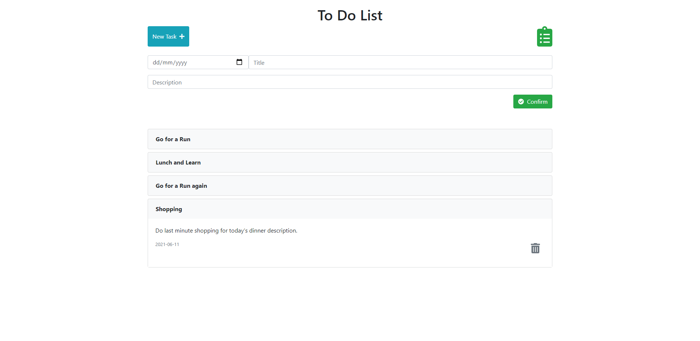

# To Do List

> To Do List is a simple Javascript app that lets you add tasks by date and delete them when done.

## Built With

- JavaScript
- HTML
- CSS

## Libraries and packages

- NPM
- Bootstrap
- Fontawesome

## [Live demo](https://raw.githack.com/paulo-techie/to-do-list/feature-todos/index.html)

### how to run locally

- Download and install [Node.js](https://nodejs.org/en/download/)
- Clone this repository on your terminal by running `git clone https://github.com/paulo-techie/to-do-list.git`
- Change your current working directory to the project directory `cd to-do-list`
- Run `npm install`
- Run `npm install --save @fortawesome/fontawesome-free`
- Run `npm start`
- Enjoy

## Contributor

👤 Paul Omondi

- Github: [@paulo-techie](https://github.com/paulo-techie)

## 🤝 Contributing

Contributions, issues and feature requests are welcome!

Feel free to check the [issues page](../../issues/).

## Show your support

Give a ⭐️ if you like this project!

## Acknowledgments

- Hat tip to anyone whose code was used
- Inspiration
- etc

## 📝 License

This project is  [MIT](./MIT.md) licensed.
